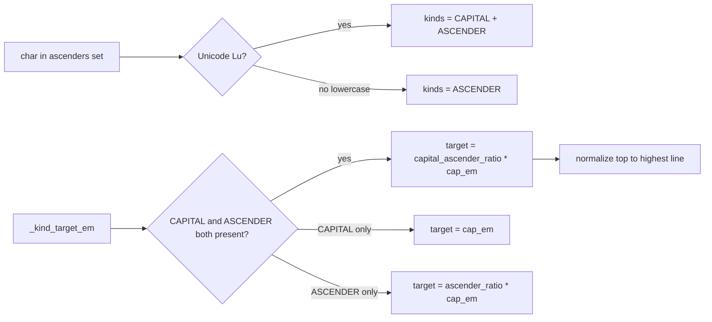

# Plan: Capital+Ascender letter kind

## Goal

Add support for a new letter kind — **capital+ascender** — for letters like
Cyrillic Ё (U+401) and Й (U+419) whose top sits *above* the plain capitals
line. These are uppercase letters that also have an ascender component
(a diacritic or stroke rising above cap height), so they need their own
reference line higher than the capitals line.

## Design decision (confirmed with user)

**Explicit listing.** The user adds uppercase Ё/Й to the existing
`ascenders` list alongside the lowercase forms. Classification inspects
case to assign the combined `CAPITAL_ASCENDER` kind vs. plain `ASCENDER`.

This mirrors the existing `CAPITAL`+`DESCENDER` pattern (Ц, Щ, Д): the
Unicode-category fallback adds `CAPITAL` for uppercase letters on top of
the explicit-set kind, producing a combined kind set. We do the same for
uppercase letters in the ascenders set → `{CAPITAL, ASCENDER}`.

**No new `Kind` enum value is added.** The combined kind is represented
as the set `{Kind.CAPITAL, Kind.ASCENDER}`, exactly analogous to how
`{Kind.CAPITAL, Kind.DESCENDER}` already represents capital+descender.
This keeps the enum stable and reuses all existing set-based logic.

## Architecture



## Changes by file

### 1. `glyph_extractor/letter_kinds.py`

- **`DEFAULT_ASCENDERS`**: add uppercase `ЁЙ` so they classify as
  capital+ascender by default. Current value already contains `Й`
  (`"бвдёйЙфbdfhklt߃"`); add `Ё`:
  `"бвдёйЙЁфbdfhklt߃"`.
- **`DEFAULT_KIND_RATIOS`**: add a new entry for the combined
  capital+ascender top. Since the enum has no `CAPITAL_ASCENDER` value,
  use a **string key** `"capital_ascender"` (not a `Kind` enum member)
  stored alongside the kind-based ratios:
  ```python
  "capital_ascender": 1.1,  # top, above the capitals line
  ```
  Default 1.1 (10% above cap height) — a reasonable starting point for
  diacritic-bearing capitals; calibration will refine it.
- **`word_scale_factor`**: extend the top-extent aggregation to include
  the `capital_ascender` ratio when the word contains a
  capital+ascender glyph. Add a helper that, given a word's char set,
  computes whether any char is `{CAPITAL, ASCENDER}` and, if so, adds
  the `capital_ascender` top ratio to the `tops` list. Concretely:
  - Add `_CAPITAL_ASCENDER_KEY = "capital_ascender"`.
  - In `word_scale_factor`, after building `tops` from per-kind ratios,
    if any kind set in the word is `{CAPITAL, ASCENDER}` (both present
    for the same char), append `ratios.get(_CAPITAL_ASCENDER_KEY, 1.1)`
    to `tops`. This requires `word_scale_factor` to receive per-char
    kind info, not just the aggregated kind tuple — see step 2.
- **`word_kinds_from_chars`**: the aggregated kind tuple is currently
  a flat set union. To support the combined kind in the scale factor,
  we need to know if *any single char* is both CAPITAL and ASCENDER.
  Add an optional flag/tuple: extend the returned tuple to include a
  synthetic `"capital_ascender"` entry when any char yields
  `{CAPITAL, ASCENDER}`. This keeps the tuple hashable and storable on
  `GlyphInstance.word_kinds`. Update `_EXTENT_KINDS` handling so the
  synthetic key is recognized.

  *Simpler alternative*: keep `word_kinds_from_chars` returning `Kind`
  values only, and have `word_scale_factor` receive the raw char
  sequence (or a precomputed "has capital+ascender" bool). But
  `word_kinds` is already stored on instances and used as the lookup
  key into the scale-factor cache, so changing its signature is
  invasive. **Preferred**: emit the synthetic `"capital_ascender"`
  string into the `word_kinds` tuple when the combination is present.
  `word_scale_factor` already looks up ratios by string key, so it
  picks up the new ratio naturally with no special-casing.

### 2. `glyph_extractor/project.py`

- **`calibrate_kind_ratios`**: add a bucket for `capital_ascender` tops.
  For each instance whose char's kind set is exactly
  `{CAPITAL, ASCENDER}` (both present), record `top_px` into
  `tops["capital_ascender"]`. After computing `cap_ref`, set
  `ratios["capital_ascender"] = median(tops["capital_ascender"]) / cap_ref`
  when samples exist; otherwise keep the default (1.1). Do **not** also
  bucket these instances under plain `CAPITAL` or `ASCENDER` — they
  belong to the combined kind only (their top is above the capitals
  line, so including them in the capital median would skew it upward).
  - This requires splitting the per-kind loop: if
    `{CAPITAL, ASCENDER} ⊆ kinds`, bucket into `capital_ascender` and
    `continue`; otherwise bucket into the individual kinds as today.
- **`word_scale_factor_for`**: no change needed if `word_kinds` now
  carries the synthetic key — `word_scale_factor` picks it up.
- **Serialization**: `kind_ratios` is already a free-form dict, so the
  new key serializes automatically. No version bump needed (it's a new
  optional ratio; old projects without it fall back to the default via
  `ratios.get(key, DEFAULT)`). Confirm `_project_from_dict` merges
  defaults so the new key is present after load.

### 3. `glyph_extractor/vectorize.py`

- **`_kind_target_em`**: add a check *before* the plain `CAPITAL` branch
  for the combined case:
  ```python
  if Kind.CAPITAL in kinds and Kind.ASCENDER in kinds:
      ratio = proj.kind_ratios.get("capital_ascender", 1.1)
      return ratio * cap_height_em
  ```
  This must come first so capital+ascender normalizes to the higher
  line, not the plain capitals line.
- **`_is_baseline_anchoring_letter`**: capital+ascender letters sit on
  the baseline (Ё, Й have no descender), so they should be
  baseline-anchored. Current logic: returns True if
  `kinds & _BASELINE_ANCHORING_KINDS` and no DESCENDER. Since
  `{CAPITAL, ASCENDER}` intersects `_BASELINE_ANCHORING_KINDS` (both
  CAPITAL and ASCENDER are in it) and has no DESCENDER, this already
  returns True. **No change needed.**
- **`_compute_scale`**: no change — it calls `_kind_target_em` and
  `put_on_baseline` via the helpers above.

### 4. `glyph_extractor/widgets/vector_preview.py`

- **`_KIND_COLORS`**: add an entry for the new key:
  `"capital_ascender": QColor(0, 160, 0)` (green, distinct from the
  existing blue/orange/purple/teal/red).
- **`_TOP_KINDS`**: the synthetic key is a string, not a `Kind` enum
  value, so `Kind(kind)` in `_draw_kind_lines` will raise `ValueError`
  and be skipped by the existing `try/except`. Fix: handle the
  `capital_ascender` key explicitly — treat it as a top kind. Add
  `_CAPITAL_ASCENDER_KEY = "capital_ascender"` and include it in the
  top-kind check (e.g. `if k in _TOP_KINDS or k == _CAPITAL_ASCENDER_KEY`).
- The line will draw above the capitals line, labeled
  `"capital_ascender <em>em"`.

### 5. `glyph_extractor/widgets/settings_dialog.py`

- **Hint text**: update the `cls_hint` to mention that uppercase letters
  in the ascenders list (e.g. Ё, Й) are treated as capital+ascender
  (their top normalizes to a line above the capitals line). Example:
  > "Lowercase letters whose top rises above the x-height are
  > ascenders; those whose bottom drops below the baseline are
  > descenders. An **uppercase** letter in the ascenders list (e.g.
  > Ё, Й) is a capital+ascender — its top normalizes above the
  > capitals line. A letter in both lists (e.g. ф) is both. Not
  > locale-dependent."
- **Placeholder**: update the ascenders placeholder to show uppercase
  forms, e.g. `"e.g. бвдёйЙЁфbdfhklt"`.

### 6. `glyph_extractor/widgets/glyph_browser.py`

- **`_metrics_text`**: no structural change; the instance scale already
  reflects the per-kind target. Optionally add a note when the glyph is
  capital+ascender (e.g. "capital+ascender") for clarity. Low priority.

## Verification

Using `examples/ex5.glyphproj` (or a project containing Ё/Й):
- Ё (U+401): classified `{CAPITAL, ASCENDER}` → `put_on_baseline` →
  top normalized to `capital_ascender_ratio * cap_height_em` (above the
  capitals line). Verify `inst.scale_factor` and the preview reference
  line.
- Й (U+419): same.
- Plain capitals (А, Б): still normalize to the capitals line
  (`cap_height_em`), unaffected.
- Plain ascenders (б, д): still normalize to the ascenders line,
  unaffected.
- `calibrate_kind_ratios` produces a `capital_ascender` ratio > 1.0
  from committed Ё/Й samples.
- Word scale factor `F` for a word containing Ё includes the
  `capital_ascender` top, so the word bbox maps correctly.

## Risks / edge cases

- **Ё also a descender?** No — Ё/Й have no descender. If a future font
  has a capital+ascender+descender letter, the current priority
  (capital+ascender check first, then capital, then ascender, then
  regular/descender) handles the top correctly; the descender depth
  follows from the word-level fallback. Acceptable for now.
- **Old projects**: `kind_ratios` loaded from JSON won't have the
  `capital_ascender` key. All lookups use `.get(key, default)`, so they
  fall back to 1.1. Running "Re-calibrate" populates it. No migration
  needed.
- **`word_kinds` tuple change**: adding the synthetic string to the
  tuple changes its value for words containing Ё/Й. This affects the
  `word_scale_factor_for` cache key, but since it's computed fresh each
  time (no persistent cache keyed on it), this is safe. Stored
  `word_kinds` on existing instances will be stale for such words until
  re-added; `calibrate_kind_ratios` uses `letter_kinds_for(inst.char)`
  directly (not the stored tuple), so calibration is unaffected.