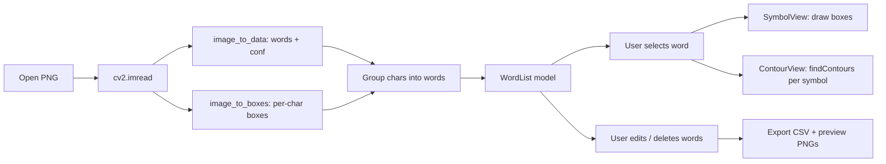

# Glyph Extractor — Architecture Plan

## Overview

A PyQt5 desktop application that lets a user open a PNG image, review OCR-detected
words, inspect per-symbol bounding boxes and contours, fix OCR errors, delete bad words,
and export a per-symbol CSV dataset (one row per glyph) with preview PNGs.

## Tech Stack

- Python 3.9+
- PyQt5 (GUI)
- OpenCV (`cv2` v4) — image handling, contour detection
- pytesseract — OCR text + per-symbol boxes
- Pillow — image conversion between cv2 / Qt
- Standard library: `csv`, `os`, `pathlib`, `dataclasses`

## Project Structure

```
glyph-extractor/
├── main.py                 # entry point
├── requirements.txt
├── glyph_extractor/
│   ├── __init__.py
│   ├── app.py              # QApplication + MainWindow wiring
│   ├── main_window.py      # 3-panel QMainWindow
│   ├── ocr.py              # tesseract word + box extraction
│   ├── contours.py         # cv2.findContours per symbol crop
│   ├── models.py           # Word / Symbol dataclasses
│   ├── export.py           # CSV writer + preview PNG saver
│   └── widgets/
│       ├── __init__.py
│       ├── word_list.py    # left panel: editable QListWidget
│       ├── symbol_view.py  # upper-right: image fragment + boxes
│       └── contour_view.py # bottom-right: contour rendering
└── examples/
    └── step1_review.csv    # reference output
```

## Data Model

### `Word`
- `index: int`
- `text: str`            — editable, length must stay constant
- `box: (x, y, w, h)`    — word bounding box (image coords)
- `conf: float`          — tesseract confidence
- `symbols: list[Symbol]`

### `Symbol`
- `index: int`
- `char: str`             — single character (from word text)
- `box: (x, y, w, h)`    — tesseract `image_to_boxes` coords
- `contour_pts: list[(x,y)]` — from `cv2.findContours` on the symbol crop
- `preview_path: str`    — relative path to saved PNG
- `status: str`          — "ok" | "fix"

## OCR Pipeline

1. Load image with `cv2.imread(path)` → grayscale for tesseract.
2. `pytesseract.image_to_data(image, output_type=DICT)` → words with conf + bbox.
3. Filter out empty / low-confidence noise words (conf threshold optional, default keep all).
4. For each word, `pytesseract.image_to_boxes(image)` returns per-char boxes
   (char, x, y, w, h) in tesseract coords (y measured from bottom).
   Convert y to image-top-down coords: `y_img = img_h - y`.
5. Group char boxes by word using x-overlap / word bbox containment.

## Contour Extraction (per symbol)

For each symbol:
1. Crop the symbol region from the grayscale image using its tesseract box (with small padding).
2. Threshold the crop (Otsu or fixed) to binary.
3. `cv2.findContours(thresh, cv2.RETR_TREE, cv2.CHAIN_APPROX_SIMPLE)`.
4. Pick the largest contour (by area) as the glyph contour.
5. Convert contour points back to absolute image coordinates (add crop offset).
6. Store as `list[(x, y)]` for CSV; render in bottom-right panel.

## GUI Layout (QMainWindow)

```
┌──────────────────────────────────────────────────────┐
│ Menu: File > Open PNG | Export CSV                   │
├──────────────┬───────────────────────────────────────┤
│              │  Upper-right: SymbolView               │
│  WordList    │  (image fragment + per-symbol boxes)   │
│  (left)      ├───────────────────────────────────────┤
│              │  Bottom-right: ContourView             │
│              │  (glyph contour polygons)              │
└──────────────┴───────────────────────────────────────┘
```

### Left Panel — `WordListWidget`
- `QListWidget` populated with word text.
- Double-click → inline edit; validator enforces **same length** (reject changes that alter length).
- Context menu / Delete key → remove selected word from list + model.
- Selection change → emit `word_selected(Word)` signal.

### Upper-Right — `SymbolViewWidget`
- `QLabel` inside `QScrollArea`, displays the cropped word image fragment.
- Bounding boxes drawn around every symbol using `cv2.rectangle` (green) before converting to `QPixmap`.
- Re-rendered on each word selection.

### Bottom-Right — `ContourViewWidget`
- `QLabel` showing a blank canvas sized to the word bbox.
- Each symbol's contour drawn as a filled/outline polygon (`cv2.fillPoly` / `cv2.polylines`), one color per symbol.
- Re-rendered on each word selection.

## Word Editing Rules

- Editing is allowed only if the new text has the **same character count** as the original.
- On edit: update `Word.text`, update each `Symbol.char` by position, recompute `status`
  (ok if `conf >= 50` else fix), update list item label.
- If length differs: show `QMessageBox.warning`, reject the edit.

## Word Deletion

- Remove the selected `Word` from the model and the `QListWidget`.
- Re-index remaining words (optional; keep stable ids for export).

## CSV Export

On "Export CSV":
1. User picks output directory via `QFileDialog.getExistingDirectory`.
2. Create `<outdir>/previews/` subfolder.
3. For every remaining word, for every symbol:
   - Save the symbol crop as `previews/gNNN.png` (NNN = global running index, zero-padded 3).
   - Build a CSV row:
     ```
     id, codepoint, label, suggested_label, status, preview_path,
     contour_pts, bbox, notes
     ```
   - `id`            = global symbol index
   - `codepoint`     = `format(ord(label), 'x')` (hex)
   - `label`         = current `Symbol.char`
   - `suggested_label` = original tesseract char
   - `status`        = "ok" if `conf >= 50` else "fix"
   - `preview_path`  = `previews/gNNN.png` (relative)
   - `contour_pts`   = `"x,y;x,y;..."` (semicolon-separated)
   - `bbox`          = `"x,y,w,h"` (image coords)
   - `notes`         = `f"conf={conf:.1f}"`
4. Write `<outdir>/step1_review.csv` with header row.

## Mermaid — Data Flow



## Dependencies (`requirements.txt`)

```
PyQt5>=5.15
opencv-python>=4.5
pytesseract>=0.3.10
Pillow>=9.0
numpy>=1.21
```

System requirement: `tesseract-ocr` binary installed and on PATH (or set
`pytesseract.pytesseract.tesseract_cmd`).

## Implementation Order

1. Scaffold project + `requirements.txt`.
2. `models.py` dataclasses.
3. `ocr.py` — word + box extraction, grouping.
4. `contours.py` — per-symbol contour extraction.
5. `widgets/` — three panel widgets.
6. `main_window.py` — assemble layout, wire signals.
7. `export.py` — CSV + preview PNGs.
8. `main.py` — entry point.
9. Manual test with a sample PNG.