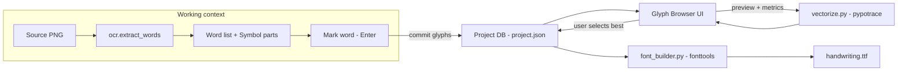

# Project-based configuration & TrueType font generation

## Goal

Replace the CSV-centric workflow with an internally managed **project database**
(`project.json`) that accumulates glyph data across multiple source images, and
add the ability to assemble a TrueType font directly from the project using
`pypotrace` (contours → bezier) and `fonttools` (font creation).

## Key decisions (confirmed with user)

1. **Storage:** a single `project.json` holding everything in memory-serialized
   form. Simplest to implement; load/save on project open/save.
2. **CSV export:** kept as an optional fallback/debug tool. The project DB is
   the primary workflow.
3. **Multi-image:** images are opened one at a time into the open project.
   Marking a word commits its glyphs into the DB. The current image is a
   transient working context (not stored in the project).
4. **Best-instance selection:** auto-pick the instance with the highest OCR
   confidence / cleanest contours; the user can override via a glyph-browser UI
   that previews vectorized bezier output + metrics.

## Architecture

## New / changed modules

### Data layer

- `glyph_extractor/project.py` (new)
  - `GlyphInstance` dataclass: codepoint, char, source ref (image basename +
    word index + sym index for traceability), bbox, parts (list of GlyphPart),
    baseline_y, word_bbox, ocr_conf, preview_png (base64 or path under
    project folder), advance_width (derived), vector_cache (bezier curves,
    lazily computed).
  - `Project` dataclass: name, created_at, units_per_em (default 1000),
    ascent/descent estimates, `glyphs: dict[str, list[GlyphInstance]]` keyed
    by codepoint hex, `selected: dict[str, int]` mapping codepoint → chosen
    instance index (default auto).
  - Functions: `create_project(path)`, `load_project(path)`, `save_project()`,
    `add_word_glyphs(project, word)`, `auto_select_best(instance)`,
    `best_instance(project, codepoint)`, `collection_summary(project)`.
  - JSON serialization via dataclasses + a custom encoder for tuples/np types.

### Vectorization layer

- `glyph_extractor/vectorize.py` (new)
  - `vectorize_parts(parts) -> list[BezierPart]`: uses `pypotrace` to trace
    each outer contour and its holes into cubic bezier segments.
  - `BezierPart`: outer curves + hole curves, each a list of bezier segments
    compatible with `fontTools.pens.ttGlyphPen.TTGlyphPen`.
  - `to_tt_glyph(codepoint, instance, project) -> TTGlyph`: builds a fontTools
    glyph, positioning relative to baseline, scaling image px → em units.
  - Caches result on the `GlyphInstance.vector_cache`.

### Font assembly layer

- `glyph_extractor/font_builder.py` (new)
  - `build_font(project, out_path)`: iterates selected instances, builds a
    `fontTools.fontBuilder.FontBuilder`, sets head/name/hhea/os2/cmap/glyf/
    hmtx tables, computes advance widths from bbox width (scaled), adds GPOS
    kern table from `kerning.compute_kerning_pairs` adapted to read from the
    project DB instead of CSV, writes `.ttf`.
  - Reuses baseline logic from `models.Word.compute_baseline` (already stored
    per instance).

### UI layer

- `glyph_extractor/main_window.py` (changed)
  - New menu: **Project** → New / Open / Save / Save As / Build Font…
  - Track `self._project: Project | None`.
  - When a word is marked (Enter), if a project is open, commit its symbols
    via `add_word_glyphs`; refresh the glyph browser + status bar.
  - Status bar: "Project: <name> | <N> codepoints | <M> instances".
  - If no project is open when marking, prompt to create/open one.

- `glyph_extractor/widgets/glyph_browser.py` (new)
  - Left: list/grid of collected codepoints with count badges + "best" marker.
  - Right: for the selected codepoint, a vertical list of instances with:
    - raster preview (the cropped glyph PNG)
    - vectorized preview (rendered bezier curves onto a QPainter canvas)
    - metrics: bbox, advance width, OCR conf, baseline offset, # parts/holes
  - Controls: "Set as best", "Delete instance", "Re-vectorize".
  - Emits `project_changed` signal → main window saves / refreshes.

- `glyph_extractor/widgets/vector_preview.py` (new, small)
  - A QWidget that draws `BezierPart` curves scaled to a fixed em box, used
    inside the glyph browser.

## Workflow changes (marking)

- Marking a word (Enter) now **commits** its symbols to the project DB in
  addition to toggling the green visual state.
- Unmarking keeps the DB entries (already collected); removal is done from the
  glyph browser.
- A word can be re-marked after editing its text; the new (corrected) codepoints
  are committed. Duplicate instances for the same codepoint are allowed — the
  browser lets the user pick the best.

## Todo list

See the live todo list. Implementation order:

1. `project.py` — data model + JSON load/save + `add_word_glyphs` + auto-select.
2. `vectorize.py` — pypotrace tracing + `to_tt_glyph`.
3. `font_builder.py` — fonttools assembly + kerning from project DB.
4. `glyph_browser.py` + `vector_preview.py` — browser UI.
5. `main_window.py` — Project menu, mark-commits, status bar, browser dock.
6. Wire-up + manual test on a real scan; iterate.